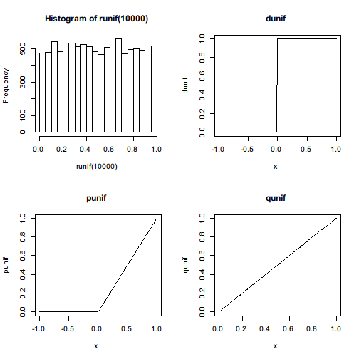

# Statistical functions

As a statistical computing environment, R provides a variety of easy-to-use statistical functions from random sampling to statistical tests. Although these built-in functions are limited, they are sufficient to handle many basic statistical problems.

## Random sampling

Random sampling is perhaps the first step of answering most statisitical questions on a population. Given a vector or a list, `sample()` function draws a sample from it with or without replacement.

For example, draw a sample of size 2 from a numeric vector without replacement.


```r
sample(c(1,2,3),size=2,replace=FALSE)
```

```
[1] 1 3
```

Another example, draw a sample of size 10 from a character vector with replacement.


```r
sample(c("a","b","z"),size=10,replace=TRUE)
```

```
 [1] "b" "a" "b" "b" "z" "b" "b" "a" "b" "z"
```

`sample()` also supports unequal weights over each observation while sampling.


```r
sample(c("Good","Medium","Poor"),size=10,replace=TRUE,prob=c(0.1,0.8,0.1))
```

```
 [1] "Medium" "Medium" "Medium" "Medium" "Medium" "Medium" "Medium"
 [8] "Medium" "Medium" "Medium"
```


## Sampling from distributions

Instead of drawing samples from a given vector or list, R also provides a set of functions to draw random samples from popular probability distributions.

### Uniform distribution

Uniform distribution is the simplest random distribution. Under uniform distribution, it is equally probable to draw any value out of a given range. To produce such a random sample, we can call


```r
runif(10)
```

```
 [1] 0.5383 0.7490 0.4201 0.1714 0.7703 0.8820 0.5491 0.2777 0.4883 0.9285
```

A random sample of size 10, represented by a numeric vector, is drawn from the uniform distribution with range $[0,1]$. To customize the range, we can specify `min=` and `max=` arguments 


```r
runif(10,min = -5,max = 5)
```

```
 [1] -1.513  4.542  1.953  3.895 -3.196  1.294  4.896 -3.697 -1.693  3.651
```

so that another sample uniformly distributed within $[-5,5]$ is drawn.

In addition to a simple random number generator, some relavent functions are also provided, including the probability density function `dunif()`, the cumulative density function `punif()`, and quantile function `qunif()`.

 

### Normal distribution

Maybe the most commonly seen random distribution in real world is the normal distribution. The way to draw normally distributed samples is almost the same with sampling from a uniform distribution. The names of the functions follow the same rules so that we don't have to remember too much.

For example, generate a sample of size 10 from standard normal distribution, that is, with zero mean and unit variance.


```r
rnorm(10)
```

```
 [1]  0.99795  0.80107  0.82010 -0.09279 -0.31225  1.93903 -0.68048
 [8] -0.04908  0.12001 -1.30859
```

To draw sample from non-standard distribution, we only have to specify the two parameters `mean=` for mean and `sd=` for standard deviation.


```r
rnorm(10,mean = 10,sd = 5)
```

```
 [1] 12.9628  4.7981  4.0237  0.8229 10.4808 10.9533 11.8074 14.6700
 [9]  5.7354  8.0848
```

In addition to the random number generator for normal distribution, R also provides with its probability density function `dnorm()`, cumulative density function `pnorm()`, and quantile function `qnorm()`.

 

Here it is obvious that R defines 4 functions for each distribution it supports. The following table covers all the distributions it supports.

[table]

## Summary statistics


```r
x.norm <- rnorm(20)
mean(x.norm)
```

```
[1] 0.01595
```

```r
sd(x.norm)
```

```
[1] 1.375
```

```r
median(x.norm)
```

```
[1] -0.263
```

```r
quantile(x.norm,probs = c(0.5,0.8))
```

```
   50%    80% 
-0.263  1.563 
```

```r
max(x.norm)
```

```
[1] 2.47
```

```r
min(x.norm)
```

```
[1] -2.708
```

```r
pmax(c(1,2,3),c(2,3,1))
```

```
[1] 2 3 3
```

```r
pmin(c(1,2,3),c(2,3,1),c(3,2,1))
```

```
[1] 1 2 1
```

```r
summary(x.norm)
```

```
   Min. 1st Qu.  Median    Mean 3rd Qu.    Max. 
-2.7100 -0.9080 -0.2630  0.0159  1.0500  2.4700 
```


## Statistical tests


```r
qnorm(c(0.01,0.99))
```

```
[1] -2.326  2.326
```

```r
table(sample(letters[1:3],100,T))
```

```

 a  b  c 
42 22 36 
```

```r
table(sample(letters[1:3],100,T),sample(LETTERS[1:4],100,T))
```

```
   
     A  B  C  D
  a  7  7 13  4
  b  7 15  8  5
  c  4 14 11  5
```

